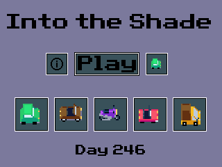

# Move the Car Into the Shade

This is a weird game where you move a car into the shade. It started out as a weird idea and then grew into a weirder idea.

---

### Installation

1. Download and send "SHADE.8xp" to Archive.
2. Download and install the CE C libraries, if you haven't already. You can download them 
   here: tiny.cc/clibs
3. Run prgmSHADE from the homescreen or shell of your choice.
---

### How to play

Use the arrow keys to move through the menus and [CLEAR] to exit the program.

In the game, your goal is to avoid over-heating and survive for 256 in-game days. You'll heat up
faster the more days you last, along with unlocking different cars to customize yourself with.

There are also three different random weathers. In sunny weather, go into the shade to cool down
and avoid the sunny areas. In rainy weather, avoid the shade (due to acid rain), and cool down by
going in the pond. In snowy weather, cool off in the shade, but watch out for the frozen pond,
which will cause you to lose control.

Complete all 256 days for a surprise!

---

### Credits

Thanks to [Edu](https://edusilvart.itch.io/) for making the awesome car sprites
that I used in this project. You can find the original sprites here: https://edusilvart.itch.io/sprite-stack-cars

Also, thank you to [RoccoLox Programs](https://github.com/RoccoLoxPrograms/), [slimeenergy](https://github.com/slimeenergyreal/), and [DJ Ominmaga](https://github.com/djomnimaga/), for
the ideas and feedback!